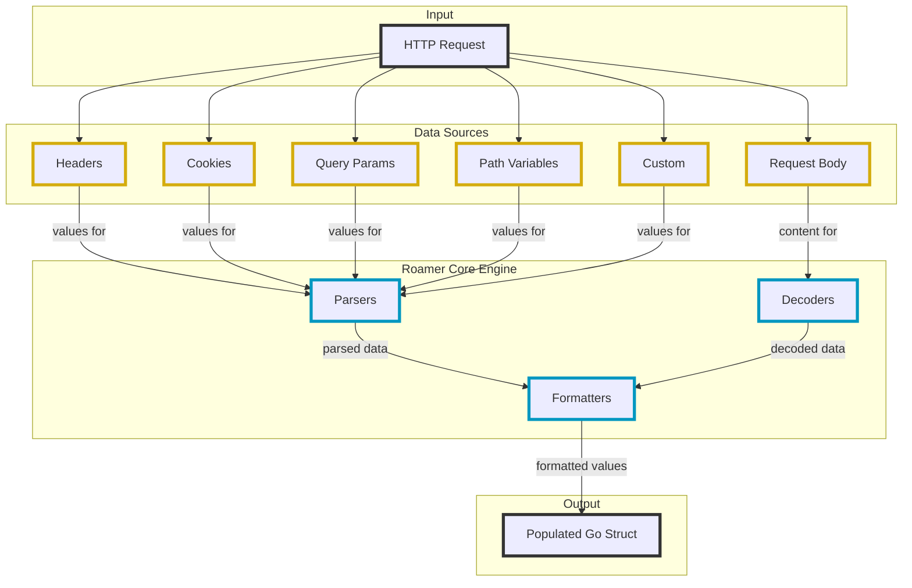

# roamer

[](https://goreportcard.com/report/github.com/slipros/roamer)
[](https://github.com/slipros/roamer/actions)
[](https://coveralls.io/github/slipros/roamer)
[](https://pkg.go.dev/github.com/slipros/roamer)
[](https://github.com/slipros/roamer)
[](https://github.com/slipros/roamer/releases)
[](https://github.com/avelino/awesome-go)

Roamer is a flexible, extensible HTTP request parser for Go that makes handling and extracting data from HTTP requests effortless. It provides a declarative way to map HTTP request data to Go structs using struct tags.



## Features

- **Multiple data sources**: Parse data from HTTP headers, cookies, query parameters, path variables, and request body
- **Content-type based decoding**: Automatically decode JSON, XML, form data, and multipart forms
- **Default Values**: Set default values for fields using the `default` tag
- **Formatters**: Transform parsed data (trim strings, apply numeric constraints, handle time zones, manipulate slices)
- **Router integration**: Built-in support for Chi, Gorilla Mux, and HttpRouter
- **Type conversion**: Automatic conversion of string values to appropriate Go types
- **Extensibility**: Easily create custom parsers, decoders, and formatters
- **Middleware support**: Convenient middleware for integrating with HTTP handlers
- **Body preservation**: Read request body multiple times when needed

## Installation

```bash
go get -u github.com/slipros/roamer@latest
```

For router integrations:

```bash
# Chi router
go get -u github.com/slipros/roamer/pkg/chi@latest

# Gorilla Mux
go get -u github.com/slipros/roamer/pkg/gorilla@latest

# HttpRouter
go get -u github.com/slipros/roamer/pkg/httprouter@latest
```

## Quick Start

```go
package main

import (
	"encoding/json"
	"log"
	"net/http"

	"github.com/slipros/roamer"
	"github.com/slipros/roamer/decoder"
	"github.com/slipros/roamer/formatter"
	"github.com/slipros/roamer/parser"
)

// Define request struct with tags
type CreateUserRequest struct {
	Name      string `json:"name" string:"trim_space"`
	Email     string `json:"email" string:"trim_space,lower"`
	Age       int    `query:"age" numeric:"min=18"`
	UserAgent string `header:"User-Agent"`
}

func main() {
	// Initialize roamer
	r := roamer.NewRoamer(
		roamer.WithDecoders(decoder.NewJSON()),
		roamer.WithParsers(
			parser.NewHeader(),
			parser.NewQuery(),
		),
		roamer.WithFormatters(
			formatter.NewString(),
			formatter.NewNumeric(),
		),
	)

	// Create handler
	http.HandleFunc("/users", func(w http.ResponseWriter, req *http.Request) {
		var userReq CreateUserRequest

		// Parse request
		if err := r.Parse(req, &userReq); err != nil {
			http.Error(w, err.Error(), http.StatusBadRequest)
			return
		}

		// Use parsed data
		w.Header().Set("Content-Type", "application/json")
		if err := json.NewEncoder(w).Encode(map[string]any{
			"name":       userReq.Name,
			"email":      userReq.Email,
			"age":        userReq.Age,
			"user_agent": userReq.UserAgent,
		}); err != nil {
			log.Printf("Failed to encode response: %v", err)
			http.Error(w, "Failed to encode response", http.StatusInternalServerError)
			return
		}
	})

	log.Fatal(http.ListenAndServe(":8080", nil))
}
```

## Examples

Comprehensive examples are available in the [examples/](examples/) directory:

### Basic Usage
- [**basic/cmd/simple**](examples/basic/cmd/simple/) - Simple request parsing
- [**basic/cmd/middleware**](examples/basic/cmd/middleware/) - Using roamer as middleware

### Router Integration
- [**chi_router/**](examples/chi_router/) - Chi router integration with path parameters
- [**gorilla_router/**](examples/gorilla_router/) - Gorilla Mux integration
- [**httprouter/**](examples/httprouter/) - HttpRouter integration

### Advanced Features
- [**formatters/**](examples/formatters/) - String, numeric, time, and slice formatters
- [**multipart/**](examples/multipart/) - File upload handling
- [**custom_parser/**](examples/custom_parser/) - Custom parser for extracting data from request context
- [**custom_decoder/**](examples/custom_decoder/) - Custom YAML decoder implementation
- [**custom_formatter/**](examples/custom_formatter/) - Custom phone number formatter
- [**body_preservation/**](examples/body_preservation/) - Reading request body multiple times

See the [examples README](examples/README.md) for a complete list and how to run them.

## Struct Tags Reference

### Data Source Tags

| Tag | Description | Example |
|-----|-------------|---------|
| `json` | Parse from JSON body | `json:"name"` |
| `xml` | Parse from XML body | `xml:"name"` |
| `form` | Parse from URL-encoded form | `form:"name"` |
| `multipart` | Parse from multipart form | `multipart:"file"` |
| `query` | Parse from query parameters | `query:"page"` |
| `header` | Parse from HTTP headers | `header:"User-Agent"` |
| `cookie` | Parse from cookies | `cookie:"session_id"` |
| `path` | Parse from path variables | `path:"id"` |
| `default` | Default value if not present | `default:"1"` |

### Formatter Tags

| Tag | Operations | Example |
|-----|------------|---------|
| `string` | `trim_space`, `lower`, `upper`, `title`, `snake`, `camel`, `kebab`, `slug` | `string:"trim_space,lower"` |
| `numeric` | `min=N`, `max=N`, `abs`, `round`, `ceil`, `floor` | `numeric:"min=0,max=100"` |
| `time` | `timezone=TZ`, `truncate=UNIT`, `start_of_day`, `end_of_day` | `time:"timezone=UTC"` |
| `slice` | `unique`, `sort`, `sort_desc`, `compact`, `limit=N` | `slice:"unique,sort"` |

## Architecture

Roamer follows a modular, interface-based architecture:

- **Parsers** - Extract data from request parts (headers, query, cookies, path)
- **Decoders** - Decode request body based on Content-Type
- **Formatters** - Post-process parsed values

This design provides:
- Clear separation of concerns
- High extensibility through interfaces
- Concurrency safety with `sync.Map` and `sync.Pool`
- Router independence
- Flexible configuration via functional options

## Creating Extensions

### Custom Parser

```go
type CustomParser struct{}

func (p *CustomParser) Parse(r *http.Request, tag reflect.StructTag, _ parser.Cache) (any, bool) {
	tagValue, ok := tag.Lookup("custom")
	if !ok {
		return "", false
	}
	// Extract and return value
	return value, true
}

func (p *CustomParser) Tag() string {
	return "custom"
}
```

### Custom Decoder

```go
type CustomDecoder struct{}

func (d *CustomDecoder) Decode(r *http.Request, ptr any) error {
	// Decode request body into ptr
	return nil
}

func (d *CustomDecoder) ContentType() string {
	return "application/custom"
}
```

### Custom Formatter

```go
type CustomFormatter struct{}

func (f *CustomFormatter) Format(tag reflect.StructTag, ptr any) error {
	tagValue, ok := tag.Lookup("custom_format")
	if !ok {
		return nil
	}
	// Format the value pointed to by ptr
	return nil
}

func (f *CustomFormatter) Tag() string {
	return "custom_format"
}
```

See the [examples/](examples/) directory for complete custom extension examples.

## Performance

Roamer is designed for production use with:
- Efficient reflection techniques
- Caching for improved performance
- Optional `sync.Pool` support for high-throughput applications
- Minimal allocations in hot paths

## Best Practices

1. **Separate request and response structs** - Use dedicated structs for parsing requests
2. **Endpoint-specific structs** - Create tailored structs for each endpoint to minimize overhead
3. **Use formatters** - Let roamer handle common transformations (trimming, case conversion, etc.)
4. **Combine with validation** - Use roamer for parsing, then validate with libraries like [validator.go](https://github.com/raoptimus/validator.go)

## Documentation

- [Go Package Documentation](https://pkg.go.dev/github.com/slipros/roamer)
- [Examples](examples/)
- [Changelog](CHANGELOG.md)

## Contributing

Contributions are welcome! Please submit issues or pull requests.

## License

Roamer is licensed under the MIT License. See the [LICENSE](LICENSE) file for details.
