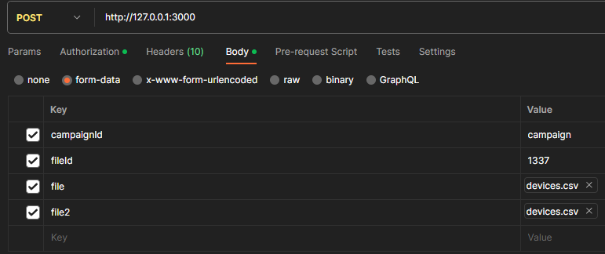

[](https://goreportcard.com/report/github.com/SLIpros/roamer)
[](https://github.com/SLIpros/roamer/actions)
[](https://coveralls.io/github/SLIpros/roamer?branch=main)
[](https://pkg.go.dev/github.com/SLIpros/roamer)
[](https://github.com/SLIpros/roamer/releases)

# roamer
Flexible http request parser

## Install
```go
go get -u github.com/SLIpros/roamer@latest
```

## Decoder

Decode body of http request based on `Content-Type` header.

| Type      | Content-Type                      |
|-----------|-----------------------------------|
| json      | application/json                  |
| xml       | application/xml                   |
| form      | application/x-www-form-urlencoded |
| multipart | multipart/form-data               |
| `custom`  | `any`                             |

# Parser
Parsing data from source.

| Type     | Source      |
|----------|-------------|
| header   | http header |
| query    | http query  |
| path     | router path |
| `custom` | `any`       |


## Examples

```go
package main

import (
	"encoding/json"
	"net/http"
	"time"

	"github.com/SLIpros/roamer"
	"github.com/SLIpros/roamer/decoder"
	"github.com/SLIpros/roamer/parser"
	"github.com/go-chi/chi/v5"
	"github.com/go-chi/chi/v5/middleware"
)

type Custom string

const (
	CustomValue Custom = "value"
)

type Body struct {
	String string  `json:"string"`
	Email  *string `json:"email"`

	Int        int       `query:"int"`
	Int8       int8      `query:"int8"`
	Int16      int16     `query:"int16"`
	Int32      int32     `query:"int32"`
	Int64      int64     `query:"int64"`
	Time       time.Time `query:"time"`
	CustomType *Custom   `query:"custom_type"`
}

func main() {
	r := roamer.NewRoamer(
		roamer.WithDecoders(decoder.NewJSON()),
		roamer.WithParsers(parser.NewQuery()),
	)

	router := chi.NewRouter()
	router.Use(middleware.Logger, roamer.Middleware[Body](r))
	router.Post("/", func(w http.ResponseWriter, r *http.Request) {
		var body Body
		if err := roamer.ParsedDataFromContext(r.Context(), &body); err != nil {
			w.Write([]byte(err.Error()))
			return
		}

		if err := json.NewEncoder(w).Encode(&body); err != nil {
			http.Error(w, err.Error(), http.StatusInternalServerError)
			return
		}
	})
	http.ListenAndServe(":3000", router)
}
```

### With path parser

```go
package main

import (
	"encoding/json"
	"net/http"

	"github.com/SLIpros/roamer"
	"github.com/SLIpros/roamer/parser"
	roamerChi "github.com/SLIpros/roamer/pkg/chi"
	"github.com/go-chi/chi/v5"
	"github.com/go-chi/chi/v5/middleware"
)

type Body struct {
	Path      string `path:"path"`
	UserAgent string `header:"User-Agent"`
	Int       int    `query:"int"`
}

func main() {
	router := chi.NewRouter()

	r := roamer.NewRoamer(
		roamer.WithParsers(
			parser.NewHeader(),                        // parse http headers
			parser.NewQuery(),                         // parse http query params
			parser.NewPath(roamerChi.NewPath(router)), // parse http path params
		),
	)

	router.Use(middleware.Logger, roamer.Middleware[Body](r))
	router.Post("/test/{path}", func(w http.ResponseWriter, r *http.Request) {
		var body Body
		if err := roamer.ParsedDataFromContext(r.Context(), &body); err != nil {
			w.Write([]byte(err.Error()))
			return
		}

		if err := json.NewEncoder(w).Encode(&body); err != nil {
			http.Error(w, err.Error(), http.StatusInternalServerError)
			return
		}
	})
	http.ListenAndServe(":3000", router)
}
```

### With custom parser

```go
package main

import (
	"context"
	"encoding/json"
	"net/http"
	"reflect"

	"github.com/SLIpros/roamer"
	"github.com/go-chi/chi/v5"
	"github.com/go-chi/chi/v5/middleware"
	"github.com/gofrs/uuid"
)

type ContextKey string

const (
	ContextKeyProfile ContextKey = "profile"
)

type Profile struct {
	Age      int
	Email    string
	ClientID uuid.UUID
}

const (
	TagProfile = "profile"
)

type ProfileParser struct{}

func (p *ProfileParser) Parse(r *http.Request, tag reflect.StructTag, _ roamer.Cache) (any, bool) {
	tagValue, ok := tag.Lookup(TagProfile)
	if !ok {
		return nil, false
	}

	profile, ok := r.Context().Value(ContextKeyProfile).(*Profile)
	if !ok {
		return nil, false
	}

	var v any
	switch tagValue {
	case "client_id":
		v = profile.ClientID
	case "email":
		v = profile.Email
	case "age":
		v = &profile.Age
	case "profile":
		v = profile
	default:
		return nil, false
	}

	return v, true
}

func (p *ProfileParser) Tag() string {
	return TagProfile
}

type Body struct {
	ClientID   *uuid.UUID `profile:"client_id"`
	Age        int        `profile:"age"`
	ProfilePtr *Profile   `profile:"profile"`
	Profile    Profile    `profile:"profile"`
}

func main() {
	r := roamer.NewRoamer(
		roamer.WithParsers(
			&ProfileParser{}, // parse profile from context
		),
	)

	router := chi.NewRouter()

	profileMiddleware := func(next http.Handler) http.Handler {
		return http.HandlerFunc(func(w http.ResponseWriter, r *http.Request) {
			profile := Profile{
				Email:    "profile@profile.com",
				ClientID: uuid.FromStringOrNil("e4aa78cd-a98a-4d9e-84ee-fea61c1c047b"),
				Age:      100,
			}

			ctxWithProfile := context.WithValue(r.Context(), ContextKeyProfile, &profile)
			next.ServeHTTP(w, r.WithContext(ctxWithProfile))
		})
	}

	router.Use(middleware.Logger, profileMiddleware, roamer.Middleware[Body](r))
	router.Post("/", func(w http.ResponseWriter, r *http.Request) {
		var body Body
		if err := roamer.ParsedDataFromContext(r.Context(), &body); err != nil {
			w.Write([]byte(err.Error()))
			return
		}

		if err := json.NewEncoder(w).Encode(&body); err != nil {
			http.Error(w, err.Error(), http.StatusInternalServerError)
			return
		}
	})
	http.ListenAndServe(":3000", router)
}
```

### With multipart/form-data decoder


```go
package main

import (
	"encoding/json"
	"net/http"

	"github.com/SLIpros/roamer"
	"github.com/SLIpros/roamer/decoder"
	"github.com/go-chi/chi/v5"
	"github.com/go-chi/chi/v5/middleware"
)

type UploadDevicesFile struct {
	CampaignID string                 `multipart:"campaignId"` // parse multipart/form-data value = campaign
	FileID     int                    `multipart:"fileId"`     // parse multipart/form-data value = 1337
	File       *decoder.MultipartFile `multipart:"file"`       // parse multipart/form-data file
	Files      decoder.MultipartFiles `multipart:",allfiles"`  // parse all multipart/form-data files = [file, file2]
}

func main() {
	r := roamer.NewRoamer(
		roamer.WithDecoders(
			decoder.NewMultipartFormData(),
		),
	)

	router := chi.NewRouter()
	router.Use(middleware.Logger, roamer.Middleware[UploadDevicesFile](r))
	router.Post("/", func(w http.ResponseWriter, r *http.Request) {
		var body UploadDevicesFile
		if err := roamer.ParsedDataFromContext(r.Context(), &body); err != nil {
			w.Write([]byte(err.Error()))
			return
		}

		if err := json.NewEncoder(w).Encode(&body); err != nil {
			http.Error(w, err.Error(), http.StatusInternalServerError)
			return
		}
	})
	http.ListenAndServe(":3000", router)
}
```