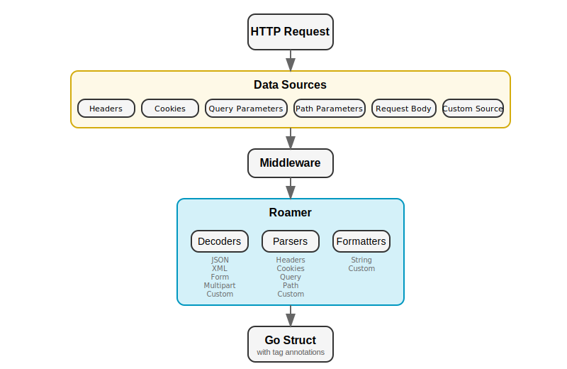

# Roamer - HTTP Request Parser for Go

[](https://goreportcard.com/report/github.com/slipros/roamer)
[](https://github.com/slipros/roamer/actions)
[](https://coveralls.io/github/slipros/roamer)
[](https://pkg.go.dev/github.com/slipros/roamer)
[](https://github.com/slipros/roamer)
[](https://github.com/slipros/roamer/releases)

Roamer is a flexible, extensible HTTP request parser for Go that makes handling and extracting data from HTTP requests effortless. It provides a declarative way to map HTTP request data to Go structs using struct tags, with support for multiple data sources and content types.

## Key Features

- **Multiple data sources**: Parse data from HTTP headers, cookies, query parameters, and path variables
- **Content-type based decoding**: Automatically decode request bodies based on Content-Type header  
- **Default Values**: Set default values for fields using the `default` tag if no value is found in the request
- **Formatters**: Format parsed data (trim spaces, apply numeric constraints, handle time zones, manipulate slices)
- **Router integration**: Built-in support for popular routers (Chi, Gorilla Mux, HttpRouter)
- **Type conversion**: Automatic conversion of string values to appropriate Go types
- **Extensibility**: Easily create custom parsers, decoders, and formatters
- **Middleware support**: Convenient middleware for integrating with HTTP handlers
- **Performance optimizations**: Efficient reflection techniques and caching

## Quick Start

### Installation

```bash
go get -u github.com/slipros/roamer@latest
```

### Basic Example

```go
package main

import (
    "encoding/json"
    "log"
    "net/http"
    "time"

    "github.com/slipros/roamer"
    "github.com/slipros/roamer/decoder"
    "github.com/slipros/roamer/formatter"
    "github.com/slipros/roamer/parser"
)

type CreateUserRequest struct {
    // From JSON body
    Name  string `json:"name" string:"trim_space"`
    Email string `json:"email" string:"trim_space"`
    
    // From query parameters
    Age       int       `query:"age"`
    CreatedAt time.Time `query:"created_at"`
    
    // From headers
    UserAgent string `header:"User-Agent"`
}

func main() {
    // Initialize roamer
    r := roamer.NewRoamer(
        roamer.WithDecoders(decoder.NewJSON()),
        roamer.WithParsers(
            parser.NewHeader(),
            parser.NewQuery(),
        ),
        roamer.WithFormatters(
            formatter.NewString(),
            formatter.NewTime(),
        ),
    )
    
    // Create HTTP handler
    http.HandleFunc("/users", func(w http.ResponseWriter, req *http.Request) {
        var userReq CreateUserRequest
        
        if err := r.Parse(req, &userReq); err != nil {
            http.Error(w, err.Error(), http.StatusBadRequest)
            return
        }
        
        // Process the parsed request...
        w.Header().Set("Content-Type", "application/json")
        if err := json.NewEncoder(w).Encode(map[string]string{
            "status": "created",
            "name": userReq.Name,
        }); err != nil {
            http.Error(w, "Failed to encode response", http.StatusInternalServerError)
            return
        }
    })
    
    log.Println("Server starting on :8080")
    if err := http.ListenAndServe(":8080", nil); err != nil {
        log.Fatalf("Server failed to start: %v", err)
    }
}
```

## Architecture Overview



The diagram above illustrates how Roamer processes HTTP requests through a simple, linear flow:

1. **HTTP Request** - Incoming request with various data sources
2. **Data Sources** - Extract data from headers, cookies, query parameters, path parameters, request body, and custom sources
3. **Middleware** - HTTP middleware integration point for seamless request processing
4. **Roamer Core** - Three main components work together:
   - **Decoders**: Handle request body parsing (JSON, XML, Form, Multipart, Custom)
   - **Parsers**: Extract data from request components (Headers, Cookies, Query, Path, Custom)  
   - **Formatters**: Post-process and validate extracted values (String, Custom)
5. **Go Struct** - Final output as a populated struct with tag annotations for type-safe data binding

## Getting Started

Ready to get started? Check out our detailed guides:

- [**Getting Started**](getting-started.html) - Installation and basic usage
- [**Examples**](examples.html) - Comprehensive examples for different use cases  
- [**API Reference**](api-reference.html) - Complete API documentation
- [**Extending Roamer**](extending.html) - Create custom parsers, decoders, and formatters

## Community & Support

- **GitHub Repository**: [github.com/slipros/roamer](https://github.com/slipros/roamer)
- **Issues & Bug Reports**: [GitHub Issues](https://github.com/slipros/roamer/issues)
- **Go Package Documentation**: [pkg.go.dev](https://pkg.go.dev/github.com/slipros/roamer)

## License

Roamer is licensed under the [MIT License](https://github.com/slipros/roamer/blob/main/LICENSE).